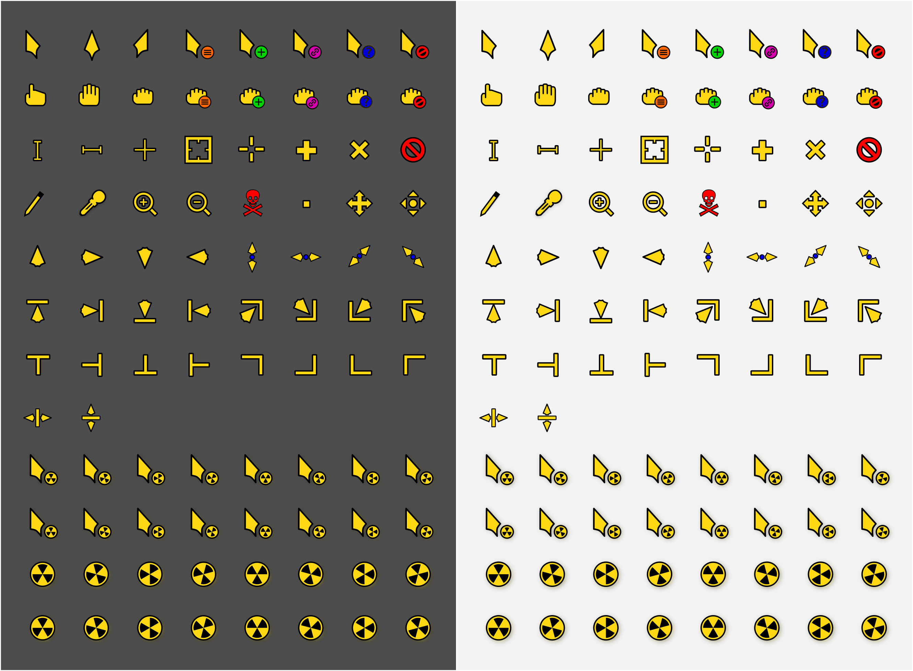

# Radioactive
<p align="center">
	
</p>
<p align = "center"> 
	 
	
</p>


Simple cursor theme for the lovers of radioactivity...

## Preview



## Installation

### Installer
To use the installer, clone the repository and go inside it.
```
git clone https://github.com/alvatip/radioactive
cd radioactive
```
Then, run the installer script. For local installation, use
``` 
./install
```
And for system wide installation use:
``` 
sudo ./install
```
### tar.gz file
Alternatively, you can use the tar.gz files located in the archive folder or in the release section and extract them to the adequate directory.</br>
For local installation:
```
tar -zxvf Radioactive.tar.gz -C $HOME/.icons/
```
For system-wide installation: 
```
tar -zxvf Radioactive.tar.gz -C /usr/share/icons/
```
### Also available on Pling
<p align="left">
  <a href="https://www.pling.com/p/1579027/" >
    
  </a>
</p>

### Set the cursor theme
There are various way to set this (or another) cursor theme.</br>
You will find all the needed informations on this [ArchWiki](https://wiki.archlinux.org/title/Cursor_themes#GNOME)

### Uninstallation
If you installed it locally, run this command in your terminal: 
```
rm -r $HOME/.icons/Radioactive*
```
And if you installed it system-wide use:
```
sudo rm -r /usr/share/icons/Radioactive*
```
## From the same author
[Nordzy](https://github.com/alvatip/Nordzy-icon) icon theme </br> 
[Nordzy-cursors](https://github.com/alvatip/Nordzy-cursors) </br>

##  Issues

If you have any issues, report them [here](https://github.com/alvatip/radioactive/issues), I will be happy to help you!

##  How can I help ?

* By giving a **star** or **follow** on GitHub.
* By **rating** it on [Pling](https://www.pling.com/p/1579027/)
* By participating to the project, creating PR, making suggestion, ...

## Licence

GNU General Public Licence v3.0.


